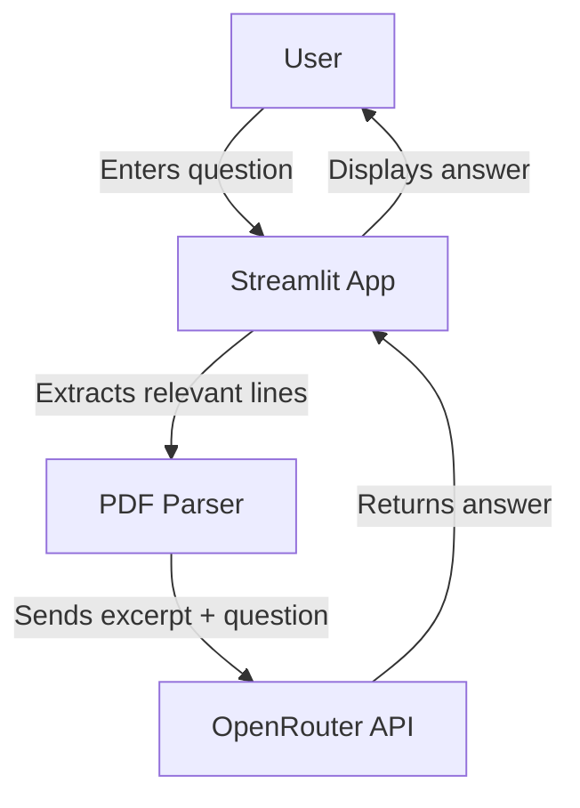

# PDF Chatbot (OpenRouter)


*A sample query and response, with the terminal-like progress box visible.*

A simple Streamlit app that lets you ask questions about links inside a PDF file, powered by an LLM via the OpenRouter API.

## Features
- Extracts and searches links from a PDF (e.g., `assets/links.pdf`).
- Sends only relevant lines to the LLM to minimize token usage and cost.
- Uses your OpenRouter API key (from `.env` or manual entry).
- Clean, minimal UI.
- **Terminal-like progress box**: See step-by-step progress of your request, from filtering the PDF to receiving the LLM's answer.

## Terminal-like Progress Box
After you submit a question, a terminal-style box appears in the app showing:
1. Filtering PDF for relevant lines
2. Preparing API request
3. Sending request to OpenRouter API
4. Response received
5. The final LLM answer

This helps you follow exactly what the app is doing at each stage of the process.

## Setup
1. **Clone the repo and install dependencies:**
   ```bash
   pip install -r requirements.txt
   ```
2. **Add your PDF:**
   - Place your PDF file with links at `assets/links.pdf`.
3. **Set your OpenRouter API key:**
   - Create a `.env` file in the project root:
     ```env
     OPENROUTER_API_KEY=sk-or-xxxxxxxxxxxxxxxxxxxxxxxxxxxxxxxxxxxxxxxxxxxxxxxxxxxx
     ```
   - Or enter it in the app UI.
4. **Run the app:**
   ```bash
   streamlit run app.py
   ```

## Usage
- Enter your question about the links in the PDF.
- The app will extract and send only relevant lines to the LLM.
- The answer and the full progress log will be shown below the input.

## How it works



## Requirements
- Python 3.8+
- Streamlit
- openai
- python-dotenv
- PyPDF2

## License
MIT 
